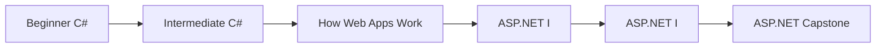

# Web-Apps-with-ASP.NET
My path to creating fast, secure and sustainable web applications.

---
[Beginner C#](https://github.com/Notios/Web-Apps-with-ASP.NET/tree/main/C%23)
--

```mermaid
graph LR
A[Beginner C#] --> B[Intermediate C#]
B[Intermediate C#] --> C[How Web Apps Work]
C[How Web Apps Work] --> D[ASP.NET I]
D[ASP.NET I] --> E[ASP.NET II]
E[ASP.NET I] --> F[ASP.NET Capstone]
```
